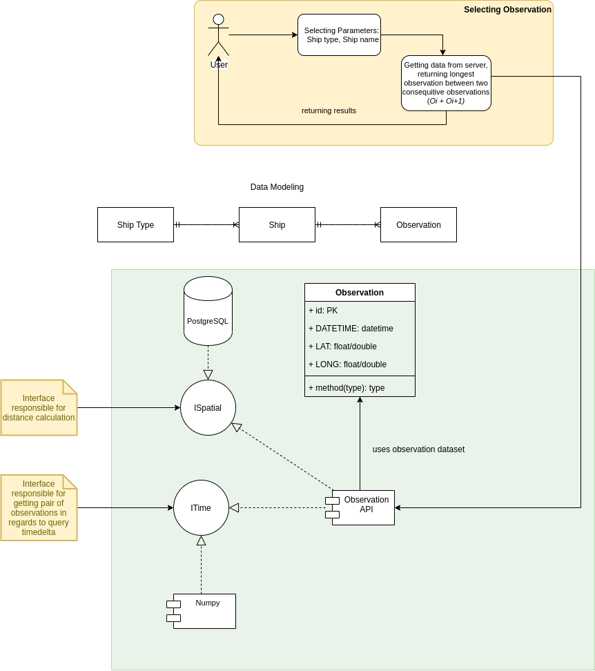

# shiny-marine
Shiny and R introductory project

General diagram of architecture

Main use case and possible solution

Data pre-processing in context of shiny R application

## project steps
### X. UML architecture and business model.
Providing diagram representing architecture dictated by business
requirements. Providing diagram showing relationship within the source
data which will allow us to implement correct data processing and
persistency strategy.

### X. Analyse data.
Using jupyternotebook or R-markdown to provide a pdf/html file showing
data analyse over source data.

So far we have used jupyternotebook where data analyse is presented, in order
to not public the dataset it will be provided in email message.

From the data set we can easily extract ship types and ship names which will
be used in shiny selects. Beside we have removed few records which have 
not valid ship names or by mispeliing or containing wrong business logic at
all. This can be seen more clearly in diagram representing model relationships.

### 0. Pre process data.
Because we are not so skilled in R yet, we will use Python to pre process
data and store it into simple database that could be used when app will be
deployed for example sqlite.

During pre processing data we encounter an issue with distance calcualtion.
So first we need to provide a function to calcuate dinstance between 2 points
and keep the highest distance.

At the moment we have created an approach where we iterate through each 
ship id dataset and compare all observations, so from each ship dataset we need to get a list of observations for which timedelta is around 30 minutes. If we would like
to do it in advance it may take some time so I wonder if it is not better to
calculate it on the fly. The possible solution would be usage of some time 
series database which could efficently filter observations by timedelta ?

For getting timedelta between observations I am thinking as well about a 2d matrix
to get a set of all possible relationships between observations and than run some
efficient operation on matrix.

Part of the work was done on jupyternotebook which will be attached separately
for confidential reasons as it extract information about dataset.

### 1. Create generic interface to read data.
We have created a separate R script responsible for connection with database.
The module has defined query strings and functions which execute them.

### 2. Access data from shiny app through interface.
Ui and Server are accessing the script and fetching data they need. So db.R is
a single source of truth for getting data structures.

### 3. Integrate custom UI elements (Leaflet.js) and encapsulate ui dropdowns.
Not sure how to cover this point, if possible we will use custom js file for shiny
app. Initially I have planned to create a htmlwidget https://shiny.rstudio.com/articles/js-build-widget.html but I have found existing
one https://rstudio.github.io/leaflet/. And because of limited time for this project
will use the existing widget.

### 4. Tests
Encountered problems with testthat package. In order to solve installed first:
```R
install.packages("devtools", dependencies = TRUE)
```
There is a problem with devtools installation a lot of dependnecies are missing
or cannot be built and in order to solve.
```bash
apt-get install libssl-dev libxml2-dev libcurl4-openssl-dev -y
```

#### Shiny application tests 
https://shiny.rstudio.com/articles/integration-testing.html

### 5. Improvements.
* Implementing R shiny modules in order to simplify application logic
and provide a better structure to the project https://shiny.rstudio.com/articles/modules.html
* Adding SQL views for types and ship names.
* Verify R dependencies to speed up building process, put R pakcages to intermediate
container to avoid redundant builds.

### 6. Instalation.
#### 6.1. Leaflet and dependencies
Problem with leaflet installation. "ERROR: dependency ‘raster’ is not available for package ‘leaflet’". Tried to install raster https://rstudio.github.io/leaflet/raster.html. After that leaflet installation is ok.

### 7. Deployment
In order to do quick deployment we have used already existing docker image for R 
and shiny apps. 
In order to install RPostgres package, ubuntu need libpq-dev
```
apt-get install libpq-dev
```
But at the end this solved the package installation
```R
install.packages('RPostgres', dependencies=TRUE, repos='http://cran.rstudio.com/')
```

### 8. Performance and Profiling, Benchmarks 
https://shiny.rstudio.com/articles/profiling.html
https://shiny.rstudio.com/articles/async.html

